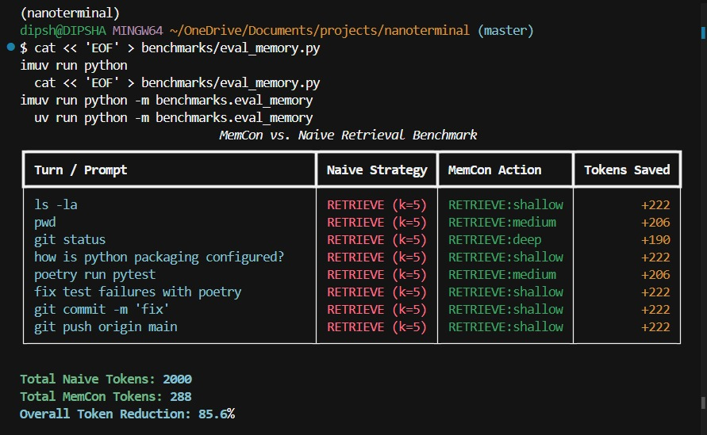

# NanoTerminal

An autonomous terminal agent powered by **Gemini 3.5 Flash** by default (override with `NANOTERMINAL_MODEL`; use `gemini-3.1-pro-preview` when your API key has Pro quota), with an **adaptive dual-loop memory architecture**: Lychee hierarchical episodic ingestion on the write path and a MemCon reinforcement-learning retrieval controller on the read path.

---

## Why NanoTerminal

Most terminal agents either dump every past turn into the prompt or always retrieve a fixed top‑k from memory. NanoTerminal treats memory as a **learned control problem**: at each step a lightweight tabular bandit decides whether to retrieve (and how deeply), inject a plan, consolidate, forget, or do nothing — **without an extra LLM call for the policy itself**.

---

## Features

| Area | What you get |
|---|---|
| **Agent loop** | Gemini native function calling (`execute_bash` / `finish_task`) |
| **Model** | Default `gemini-3.5-flash` + thinking; Lychee extract on `gemini-2.5-flash`; set `NANOTERMINAL_MODEL=gemini-3.1-pro-preview` when Pro quota is available |
| **Scaffold** | Env bootstrap, stuck replan, finish verification gate (`NANOTERMINAL_SCAFFOLD=hardened`) |
| **Execution** | Persistent cwd across turns, ~30KB output truncation, timeouts |
| **Safety** | HITL prompts for high-risk commands (`rm -rf`, hard resets, …) |
| **MemCon (read)** | φ(s) discretization, 9-action UCB1, feasibility mask, episode credit |
| **Lychee (write)** | Session buffer, centroid topic boundaries, batch JSON extraction |
| **Plans** | Success-plan index for `PLANINJECT` (`~/.nanoterminal/plans.json`) |
| **Observability** | JSON trajectories; optional Langfuse |
| **Eval** | Harbor / Terminal-Bench 2.0 + LoCoMo QA + local dual-cost benchmark + Flash/Pro compare |

---

## Terminal-Bench / Harbor

```bash
# Default: Pro + hardened scaffold, 80 turns
uv run harbor run -c harbor.yaml --env-file .env

# Flash baseline (legacy scaffold) — PowerShell:
$env:NANOTERMINAL_MODEL='gemini-2.5-flash'; $env:NANOTERMINAL_SCAFFOLD='legacy'; $env:NANOTERMINAL_THINKING='0'
uv run harbor run -c harbor.yaml --env-file .env
```

Local three-way smoke (Flash legacy / Pro legacy / Pro hardened):

```bash
uv run python benchmarks/eval_compare.py
```

Claim leaderboard scores with **≥5 attempts** per task on the full `terminal-bench@2.0` set.

## LoCoMo (conversational memory QA)

[LoCoMo](https://github.com/snap-research/locomo) measures long-term **memory accuracy** (not terminal skill). Pipeline: ingest multi-session dialog into Lychee/MemCon → MemCon retrieves context per question → Gemini answers → LoCoMo F1.

```bash
# Download dataset only
uv run python -m benchmarks.eval_locomo --download-only

# Smoke (fixture, no API for answers if you pass --mock-extract and use dialog ingest)
uv run python -m benchmarks.eval_locomo --data-file benchmarks/data/locomo_fixture.json --max-questions 2 --ingest-mode dialog --mock-extract --mock-answers

# Small real run (1 conversation, 10 questions, 2 sessions)
uv run python -m benchmarks.eval_locomo --max-samples 1 --max-questions 10 --max-sessions 2 --out-file benchmarks/locomo_results.json

# Full eval with Groq (free tier — recommended for LoCoMo)
# Add to .env: GROQ_API_KEY=gsk_...
uv run python -m benchmarks.eval_locomo --provider groq --max-samples 1 --max-questions 20 --out-file benchmarks/locomo_results.json

# Full eval with Grok (requires xAI credits)
# Add to .env: XAI_API_KEY=... and optionally NANOTERMINAL_GROK_MODEL=grok-4-1-fast-non-reasoning
uv run python -m benchmarks.eval_locomo --provider grok --out-file benchmarks/locomo_results.json

# Full eval on Gemini (needs billing / high quota; free tier ~20 RPD per model)
uv run python -m benchmarks.eval_locomo --provider gemini --out-file benchmarks/locomo_results.json
```

`--ingest-mode dialog` stores raw turns (fast baseline). `--ingest-mode lychee` (default) uses segment + batch extract. Category IDs follow the official code mapping (1=multi-hop, 2=temporal, 3=open-domain, 4=single-hop, 5=adversarial).

### Env knobs

| Variable | Default | Role |
|---|---|---|
| `NANOTERMINAL_MODEL` | `gemini-3.5-flash` | Agent model (`gemini-3.1-pro-preview` if billed) |
| `NANOTERMINAL_EXTRACT_MODEL` | `gemini-2.5-flash` | Lychee extraction model (keeps agent quota free) |
| `NANOTERMINAL_LLM_PROVIDER` | `gemini` | Set `groq` or `grok` for LoCoMo / extract |
| `GROQ_API_KEY` | (unset) | Groq API key ([console.groq.com](https://console.groq.com)) — free tier |
| `NANOTERMINAL_GROQ_MODEL` | `groq/compound-mini` | Groq model for eval / extract |
| `NANOTERMINAL_GROQ_MIN_INTERVAL` | `2.0` | Seconds between Groq calls (TPM pacing) |
| `XAI_API_KEY` | (unset) | Grok API key ([console.x.ai](https://console.x.ai)) — needs credits |
| `NANOTERMINAL_GROK_MODEL` | `grok-4-1-fast-non-reasoning` | Grok model for eval / extract |
| `NANOTERMINAL_THINKING` | `1` | Enable thinking budget on agent calls |
| `NANOTERMINAL_THINKING_BUDGET` | `8192` | Thinking token budget |
| `NANOTERMINAL_SCAFFOLD` | `hardened` | `hardened` or `legacy` |
| `NANOTERMINAL_ENV` | (unset) | Set `linux` inside Harbor containers |

---

## Adaptive dual-loop memory

Inspired by [*Memory as a Controlled Process* (MemCon)](https://arxiv.org/abs/2607.13591).

```text
┌─────────────────────────────────────────────────────────────┐
│                      User / Shell Input                     │
└──────────────────────────────┬──────────────────────────────┘
                               │
                               ▼
┌─────────────────────────────────────────────────────────────┐
│                  MemCon Read Controller (MDP)               │
│  • State φ(s): intent, step phase, stuck, cwd, store, plan  │
│  • 9-Action UCB1 + warm-start priors Q₀                     │
└──────────────┬──────────────────────────────┬───────────────┘
               │ NOOP / PlanInject / Maintain │ RETRIEVE / RE-RETRIEVE
               ▼                              ▼
     [Zero or plan context]         [Vector search in SQLite]
               │                              │
               └──────────────┬───────────────┘
                              │ Injected context
                              ▼
┌─────────────────────────────────────────────────────────────┐
│                    Agent Execution Loop                     │
│          (LLM function calls + shell tool execution)        │
└──────────────────────────────┬──────────────────────────────┘
                               │ Live turns (role, content, exit_code, cwd)
                               ▼
┌─────────────────────────────────────────────────────────────┐
│               Lychee Write Engine (segmentation)            │
│  • SessionBuffer · centroid cosine < 0.50 · 3–10 turns      │
│  • Batch structured LLM extraction (JSON schema)            │
└──────────────────────────────┬──────────────────────────────┘
                               │ Durable facts
                               ▼
┌─────────────────────────────────────────────────────────────┐
│              SQLite + FastEmbed (BGE-small) + plans.json    │
└─────────────────────────────────────────────────────────────┘
```

### Core components

**Lychee write loop** (`buffer` → `segmenter` → `store`)

- Buffers user / assistant / tool turns in RAM (embedding cost only; no extraction LLM until a boundary).
- Compares the newest turn to the centroid of prior **user** turns; segments when cosine similarity &lt; **0.50**, or at turn caps (**3–10**).
- Batch-extracts durable constraints, facts, and failure patterns; filters ephemeral CLI noise (`cd`, `ls`, typos).

**MemCon read loop** (`state` → `controller` → `engine`)

- Discretizes session signals into φ(s): intent, early/mid/late phase, stuck flag, `cwd_bin`, memory size, `plan_available`, learning phase.
- Selects among 9 actions with UCB1 and warm-start priors, filtered by a feasibility mask.
- **Executes** the chosen action (not just logs it):

| Action | Behavior |
|---|---|
| `RETRIEVE` shallow/medium/deep/insight | Vector search with `top_k` / hop / type filters |
| `RE_RETRIEVE` | Alt-query retrieve when the agent is stuck |
| `PLANINJECT` | Prepend a stored success plan for this intent |
| `CONSOLIDATE` | Merge near-duplicate SQLite records |
| `FORGET` | Evict oldest records |
| `NOOP` | Inject nothing |

Mid-task, if `consecutive_failures ≥ 2`, the agent **re-consults** MemCon so `RE_RETRIEVE` can fire before the next LLM step.

**Learning loop** (`complete_task`)

- Task reward with step efficiency:
  \(R = R_{\mathrm{succ/fail}} \pm \lambda_{\mathrm{eff}}\cdot\max(0, 1 - T/T_{\max})\)
- Reverse-discounted credit: \(\gamma^{L-t-1}\cdot R\)
- On success, upserts a generalized plan from the command trace into `plans.json`

**Vector engine & persistence**

- FastEmbed `BAAI/bge-small-en-v1.5` (ONNX; no external vector DB)
- SQLite cosine scan; Q-table / plans saved atomically (`.tmp` + `os.replace`)

### Key hyperparameters (Appendix C defaults)

| Symbol | Value | Role |
|---|---|---|
| \(\alpha\) | 0.15 | Q-learning step size |
| \(\gamma\) | 0.90 | Within-episode discount |
| \(c\) | 1.40 | UCB exploration |
| \(T_{\max}\) | 30 | Efficiency horizon |
| \(\lambda_{\mathrm{eff}}\) | 0.30 | Efficiency weight |
| Segment threshold | 0.50 | Lychee cosine boundary |

Artifacts: `~/.nanoterminal/memory.db`, `memcon_qtable.json`, `plans.json`.

### Dual cost benchmark (local)

`uv run python -m benchmarks.eval_memory` reports **two** meters (do not merge into one %):

| Path | Baseline | Ours | Result |
|---|---|---|---|
| **Read (MemCon)** | Always inject top‑5 (~250 tok/turn) | UCB retrieve / plan / noop | **2000 → 336** tokens (**83.2%**↓) |
| **Write (Lychee)** | Eager extract every exchange | Segment → batch extract | **8 → 2** LLM calls; **1672 → 580** construction tokens (**65.3%**↓) |



> `images/img.jpeg` is an older read-only screenshot (~85.6%). Re-run the command above for the current dual table.
